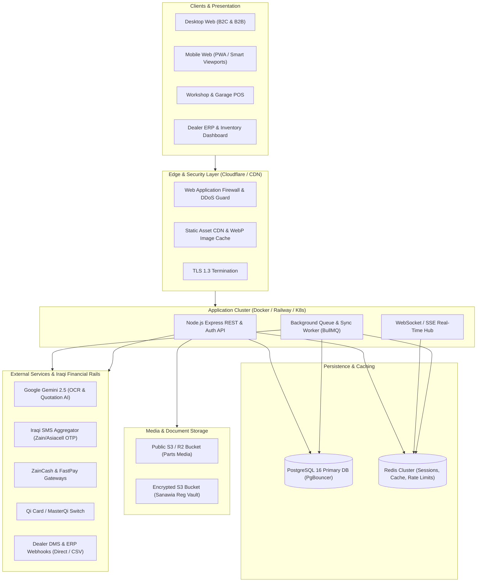

# IQPartsMarket (IQAutoMarket) — Production Readiness Roadmap & Specification

## Executive Summary

**IQPartsMarket (IQAutoMarket)** has achieved a world-class frontend design, responsive multi-device UX (desktop, tablet, mobile), native Arabic RTL typography (Tajawal), dual-currency support (USD/IQD), and a tested Role-Based Access Control (RBAC) security foundation.

To deploy the platform as a commercial, mission-critical automotive marketplace across Iraq (Baghdad, Erbil, Basra, Sulaymaniyah, and beyond), the underlying architecture must transition from in-memory prototypes and client-side mock states into an **enterprise-grade, resilient, and highly secure cloud ecosystem**.

This document outlines the end-to-end engineering requirements, architectural blueprints, database DDLs, integration strategies, and deployment checklists needed to achieve **full production readiness**.

---

## 1. Current State vs. Production Target

| Dimension | Current Implementation | Production Requirement |
| :--- | :--- | :--- |
| **Frontend UI/UX** | Emil Kowalski design system, Apple/Linear aesthetics, responsive RTL/LTR, dual-currency formatting. | **Ready.** Connect UI directly to real REST/GraphQL APIs and React Query. |
| **Database** | Relational DDL for 6 integration tables in `src/server/db.ts`; core business models run in in-memory Maps and mock arrays. | **PostgreSQL DDL Migration:** Complete relational schema (users, catalog, fitments, offers, requests, orders, audit logs). |
| **Data Flow** | Frontend state managed via React Context (`MarketplaceContext`) initialized from static mock objects. | **API Client Layer:** TanStack Query (React Query) / Axios with query caching, optimistic UI, and error boundaries. |
| **Authentication** | PBKDF2 hashing in `auth.ts` backed by ephemeral in-memory Maps. | **Persistent Session Store:** Redis-backed sessions, `HttpOnly` secure cookies, and Iraqi SMS OTP gateway. |
| **Payments** | Cash on Delivery (COD) and counter pickup simulated in client state. | **Iraqi FinTech Rails:** Native ZainCash, FastPay, Qi Card / MasterQi APIs, escrow workflows, and automated driver proof-of-delivery. |
| **Reverse RFQ & Bidding** | Client-side timers simulate quotes from mock dealers. | **Real-Time WebSockets/SSE:** Instant dealer push notifications across Iraqi governorates and live buyer quote feeds. |
| **Media & Documents** | External Unsplash URLs; vehicle registrations (Sanawia) processed in-memory. | **Cloud Object Storage (S3 / R2):** Public CDN for catalog parts + private zero-knowledge encrypted vault for sensitive registration scans. |
| **Infrastructure & Security** | In-process rate limiting, manual environment variables. | **Redis Distributed Rate Limiting**, Railway/AWS automated CI/CD, Sentry telemetry, and strict CSP headers. |

---

## 2. Production Architecture Blueprint



---

## 3. Pillar 1: Relational Database Persistence & DDL Schemas

Currently, server restarts discard active users, customer orders, and posted quotes. All business models must be mapped to PostgreSQL with foreign keys, indexes, and cascades.

### Required Tables and Schemas

#### Core Authentication & Organizations
```sql
CREATE TABLE users (
    id VARCHAR(64) PRIMARY KEY,
    email VARCHAR(255) UNIQUE,
    phone VARCHAR(50) UNIQUE NOT NULL,
    name VARCHAR(255) NOT NULL,
    password_hash VARCHAR(255) NOT NULL,
    password_salt VARCHAR(255) NOT NULL,
    role VARCHAR(32) NOT NULL CHECK (role IN ('customer', 'supplier', 'workshop', 'admin')),
    admin_sub_role VARCHAR(32),
    dealer_id VARCHAR(64),
    dealer_staff_role VARCHAR(32),
    status VARCHAR(32) DEFAULT 'ACTIVE',
    phone_verified BOOLEAN DEFAULT false,
    created_at TIMESTAMP WITH TIME ZONE DEFAULT NOW(),
    updated_at TIMESTAMP WITH TIME ZONE DEFAULT NOW()
);

CREATE TABLE user_sessions (
    id VARCHAR(64) PRIMARY KEY,
    user_id VARCHAR(64) NOT NULL REFERENCES users(id) ON DELETE CASCADE,
    token_hash VARCHAR(255) NOT NULL,
    device_info VARCHAR(255),
    ip_address VARCHAR(45),
    expires_at TIMESTAMP WITH TIME ZONE NOT NULL,
    is_revoked BOOLEAN DEFAULT false,
    created_at TIMESTAMP WITH TIME ZONE DEFAULT NOW(),
    last_active_at TIMESTAMP WITH TIME ZONE DEFAULT NOW()
);
CREATE INDEX idx_sessions_user_active ON user_sessions(user_id, is_revoked, expires_at);
```

#### Automotive Catalog & Vehicle Fitment Index
```sql
CREATE TABLE master_parts (
    id VARCHAR(64) PRIMARY KEY,
    part_number VARCHAR(100) NOT NULL,
    oem_number VARCHAR(100),
    alternative_numbers TEXT[],
    part_name VARCHAR(255) NOT NULL,
    part_name_ar VARCHAR(255) NOT NULL,
    manufacturer VARCHAR(100) NOT NULL,
    brand VARCHAR(100) NOT NULL,
    category VARCHAR(100) NOT NULL,
    subcategory VARCHAR(100),
    description TEXT,
    description_ar TEXT,
    specifications JSONB DEFAULT '{}'::jsonb,
    image_url TEXT,
    created_at TIMESTAMP WITH TIME ZONE DEFAULT NOW()
);
CREATE INDEX idx_master_parts_lookup ON master_parts(part_number, oem_number, brand);
CREATE INDEX idx_master_parts_fts ON master_parts USING GIN (to_tsvector('simple', part_number || ' ' || part_name || ' ' || brand));

CREATE TABLE vehicle_fitments (
    id SERIAL PRIMARY KEY,
    master_part_id VARCHAR(64) NOT NULL REFERENCES master_parts(id) ON DELETE CASCADE,
    make VARCHAR(100) NOT NULL,
    model VARCHAR(100) NOT NULL,
    generation VARCHAR(100),
    year_start INTEGER NOT NULL,
    year_end INTEGER NOT NULL,
    engine VARCHAR(150),
    position VARCHAR(100),
    notes TEXT
);
CREATE INDEX idx_fitments_search ON vehicle_fitments(make, model, year_start, year_end);
```

#### Inventory, Reverse Marketplace RFQ & Orders
```sql
CREATE TABLE supplier_offers (
    id VARCHAR(64) PRIMARY KEY,
    supplier_id VARCHAR(64) NOT NULL REFERENCES dealer_branches(supplier_id),
    master_part_id VARCHAR(64) NOT NULL REFERENCES master_parts(id) ON DELETE CASCADE,
    quality VARCHAR(32) NOT NULL CHECK (quality IN ('genuine', 'oem', 'aftermarket', 'used')),
    brand VARCHAR(100) NOT NULL,
    price_usd NUMERIC(10, 2) NOT NULL,
    price_iqd NUMERIC(14, 2) NOT NULL,
    stock_status VARCHAR(32) DEFAULT 'in_stock_today',
    stock_quantity INTEGER NOT NULL DEFAULT 0,
    warranty VARCHAR(150),
    delivery_time VARCHAR(150),
    branch_id VARCHAR(64) REFERENCES dealer_branches(id),
    updated_at TIMESTAMP WITH TIME ZONE DEFAULT NOW()
);
CREATE INDEX idx_offers_part_price ON supplier_offers(master_part_id, price_usd);

CREATE TABLE buyer_part_requests (
    id VARCHAR(64) PRIMARY KEY,
    request_number VARCHAR(64) UNIQUE NOT NULL,
    buyer_id VARCHAR(64) NOT NULL REFERENCES users(id),
    vehicle_info JSONB NOT NULL,
    part_name VARCHAR(255) NOT NULL,
    part_number_hint VARCHAR(100),
    part_description TEXT,
    quality_preference VARCHAR(64) DEFAULT 'genuine_or_oem',
    preferred_city VARCHAR(100) NOT NULL,
    urgency VARCHAR(50) DEFAULT 'STANDARD',
    status VARCHAR(32) DEFAULT 'OPEN' CHECK (status IN ('OPEN', 'OFFERS_RECEIVED', 'ACCEPTED', 'EXPIRED', 'CLOSED')),
    created_at TIMESTAMP WITH TIME ZONE DEFAULT NOW(),
    expires_at TIMESTAMP WITH TIME ZONE DEFAULT NOW() + INTERVAL '48 HOURS'
);

CREATE TABLE request_offers (
    id VARCHAR(64) PRIMARY KEY,
    request_id VARCHAR(64) NOT NULL REFERENCES buyer_part_requests(id) ON DELETE CASCADE,
    dealer_id VARCHAR(64) NOT NULL,
    dealer_name VARCHAR(255) NOT NULL,
    price_usd NUMERIC(10, 2) NOT NULL,
    price_iqd NUMERIC(14, 2) NOT NULL,
    quality VARCHAR(32) NOT NULL,
    brand VARCHAR(100) NOT NULL,
    warranty VARCHAR(150),
    delivery_time VARCHAR(150),
    stock_status VARCHAR(50),
    status VARCHAR(32) DEFAULT 'PENDING' CHECK (status IN ('PENDING', 'ACCEPTED', 'REJECTED', 'EXPIRED')),
    created_at TIMESTAMP WITH TIME ZONE DEFAULT NOW()
);

CREATE TABLE orders (
    id VARCHAR(64) PRIMARY KEY,
    order_number VARCHAR(64) UNIQUE NOT NULL,
    buyer_id VARCHAR(64) NOT NULL REFERENCES users(id),
    supplier_id VARCHAR(64) NOT NULL,
    total_usd NUMERIC(10, 2) NOT NULL,
    total_iqd NUMERIC(14, 2) NOT NULL,
    delivery_fee_usd NUMERIC(8, 2) DEFAULT 0,
    delivery_method VARCHAR(50) NOT NULL,
    delivery_address TEXT NOT NULL,
    payment_method VARCHAR(50) NOT NULL,
    payment_status VARCHAR(32) DEFAULT 'UNPAID' CHECK (payment_status IN ('UNPAID', 'ESCROW_HELD', 'SETTLED', 'REFUNDED')),
    order_status VARCHAR(32) DEFAULT 'PLACED' CHECK (order_status IN ('PLACED', 'CONFIRMED', 'DISPATCHED', 'OUT_FOR_DELIVERY', 'DELIVERED', 'CANCELLED')),
    items JSONB NOT NULL,
    created_at TIMESTAMP WITH TIME ZONE DEFAULT NOW(),
    updated_at TIMESTAMP WITH TIME ZONE DEFAULT NOW()
);
```

### Database Operational Strategy
- **ORM / Migrations:** Implement **Prisma** or **Drizzle ORM** for type-safe database queries and automated migrations (`npm run db:migrate`).
- **Connection Pooling:** Use **PgBouncer** (max pool 30–50 connections) to prevent connection exhaustion during high-concurrency mobile traffic spikes.
- **Automated Backup & Recovery:** Enable daily automated backups with 30-day retention and Point-In-Time Recovery (PITR) via Railway Database or AWS RDS.

---

## 4. Pillar 2: Frontend-to-Backend API Wire-Up

Currently, components in `src/components/` operate on local React states initialized from mock constants in `src/data/mockData.ts`.

### 1. Introduce TanStack Query (React Query)
Replace local mutation and filter logic in `MarketplaceContext.tsx` with server state synchronization:
```typescript
// Example: src/hooks/usePartsCatalog.ts
import { useQuery } from '@tanstack/react-query';

export function usePartsCatalog(params: {
  category?: string;
  search?: string;
  vehicleId?: string;
  quality?: string;
  sortBy?: string;
}) {
  return useQuery({
    queryKey: ['parts', params],
    queryFn: async () => {
      const qs = new URLSearchParams(params as Record<string, string>).toString();
      const res = await fetch(`/api/v1/parts?${qs}`, { credentials: 'include' });
      if (!res.ok) throw new Error('Failed to fetch parts catalog');
      return res.json();
    },
    staleTime: 1000 * 60 * 3, // 3 minutes cache
  });
}
```

### 2. Real Cookie-Based Authentication Flow
- Move away from storing access tokens in `localStorage`.
- Emit `Set-Cookie: iqm_session=...; HttpOnly; Secure; SameSite=Strict; Path=/; Max-Age=604800` from `/api/auth/login`.
- Automatically validate sessions via an initial `GET /api/auth/me` on application boot.

### 3. SMS Gateway Integration for Phone-First Verification
Iraqi users rely predominantly on mobile numbers rather than email addresses.
- Integrate with an Iraqi SMS aggregator (Zain, Asiacell, Korek) or global API (Twilio / Infobip).
- Generate a 6-digit cryptographic OTP stored in Redis with a 3-minute TTL and max 3 retry attempts.

---

## 5. Pillar 3: Iraqi FinTech & Payment Integrations

Automotive spare parts in Iraq involve significant transaction values (from a $10 oil filter to a $2,500 Land Cruiser transmission).

### 1. Mobile Wallets (ZainCash & FastPay)
- **ZainCash Merchant API:** Implement the server-to-server redirection and transaction verification webhook (`/api/v1/payments/zaincash/callback`).
- **FastPay API:** Common across Erbil, Sulaymaniyah, and Duhok for immediate dinar transactions.

### 2. Qi Card / MasterQi Switch
- Connect to the **International Smart Card (ISC / Qi Card)** gateway for corporate and government employee electronic payments.

### 3. Cash on Delivery (COD) & Driver Verification Codes
Because COD remains widespread in Iraq:
- Generate a unique 4-digit **Delivery Confirmation PIN** on order dispatch.
- The courier must collect cash and enter the buyer's PIN into the delivery mobile view to release funds and mark the order as `DELIVERED`.

### 4. Dynamic Exchange Rate Engine
- Deploy an automated cron job updating the commercial exchange rate (e.g. 1 USD = 1,510 IQD) once every 6 hours from market feeds, preventing price discrepancies between dealers quoting in USD and buyers paying in IQD.

---

## 6. Pillar 4: Real-Time Bidding & Inventory Synchronization

The competitive reverse-marketplace model requires instant communication between buyers requesting hard-to-find parts and accredited dealers.

### 1. WebSocket / SSE Architecture
- Implement a dedicated WebSocket gateway (e.g., `Socket.io` or Node.js `ws`):
  - **Dealer Room (`dealers:baghdad`, `dealers:erbil`)**: When a buyer submits a new part request, matching dealers receive a notification: `"New Request: 2021 Prado Front Brake Booster"`.
  - **Buyer Room (`buyer:req_12345`)**: When a dealer posts an offer, the buyer's UI updates in real time with the new bid, price, warranty, and seller rating.

### 2. Automated Inventory Deduction
- Prevent overselling: when an order is created, execute an atomic transaction in PostgreSQL:
  ```sql
  UPDATE supplier_offers
  SET stock_quantity = stock_quantity - 1
  WHERE id = $1 AND stock_quantity >= 1;
  ```
- If quantity hits 0, update `stock_status` to `'out_of_stock'` and notify connected clients.

---

## 7. Pillar 5: Cloud Storage & Sensitive Document Security

### 1. Storage Partitioning
- **Public Bucket (Cloudflare R2 / AWS S3):**
  - High-resolution, multi-angle part photography.
  - Processed through Sharp for WebP compression and responsive srcset generation (`w_300`, `w_600`, `w_1200`).
- **Private Encrypted Bucket (Vehicle Registration Vault):**
  - Stores Iraqi vehicle registration cards (*Sanawia*) uploaded via AI OCR.
  - Encrypted at rest using AES-256 with customer-isolated directory keys.

### 2. Document Privacy & Automated Shredding
- **Zero-Dealer Access Rule:** Dealers receive vehicle specifications (Make, Model, Year, Engine, Trim), but **never** the physical registration card or owner personal details.
- **Automated Lifecycle Policy:** Original Sanawia images are deleted 72 hours after successful OCR vehicle verification.

---

## 8. Pillar 6: Security, Rate Limiting & Secret Hygiene

### 1. Redis-Backed Distributed Rate Limiting
Replace the single-node in-memory `rateLimitMap` in `server.ts` with Redis:
```typescript
import rateLimit from 'express-rate-limit';
import RedisStore from 'rate-limit-redis';
import { redisClient } from './redis';

export const authLimiter = rateLimit({
  store: new RedisStore({ sendCommand: (...args: string[]) => redisClient.call(...args) }),
  windowMs: 15 * 60 * 1000, // 15 minutes
  max: 10, // Max 10 failed login attempts per IP
  message: { error: 'TOO_MANY_REQUESTS', message: 'Too many login attempts. Please try again in 15 minutes.' }
});
```

### 2. Secret Hygiene
- Ensure `.env.example` contains only generic placeholder values (rotate any leaked database credentials).
- Enforce strict environment variable injection via Railway or cloud key vaults.

### 3. Security Headers & Defense in Depth
- Enforce Content Security Policy (CSP):
  ```
  Content-Security-Policy: default-src 'self'; img-src 'self' data: https: blob:; script-src 'self'; style-src 'self' 'unsafe-inline' https://fonts.googleapis.com; font-src 'self' https://fonts.gstatic.com;
  ```

---

## 9. Pillar 7: DevOps, Observability & CI/CD

### 1. Production Health Probes
Expose standard Kubernetes/Railway health check endpoints in `server.ts`:
```typescript
app.get('/healthz', async (req, res) => {
  const dbConnected = isDbConnected();
  if (!dbConnected) {
    return res.status(503).json({ status: 'unhealthy', db: false });
  }
  res.status(200).json({ status: 'healthy', timestamp: new Date().toISOString() });
});
```

### 2. GitHub Actions CI/CD Pipeline
Create `.github/workflows/deploy.yml`:
1. **Lint & Type Check:** `npm run lint` (`tsc --noEmit`)
2. **Security & RBAC Matrix Test:** `npm run test:security`
3. **Frontend Production Build:** `npm run build`
4. **Automated Docker Image Deployment:** Push image to Railway / Cloud Registry upon merge to `main`.

### 3. Application Telemetry & Logging
- **Sentry Integration:** Capture unhandled client-side React exceptions and server-side 500 errors.
- **Structured JSON Logging (Pino):** Log every API call with correlation IDs (`reqId`), response status, latency, and sanitized actor info for audit trails.

---

## 10. Phased Implementation Roadmap

```
PHASE 1: Core Persistence (Weeks 1 - 2)
├── Provision PostgreSQL 16 on Railway / AWS RDS
├── Set up Prisma/Drizzle schemas and run initial DDL migrations
├── Populate Master Parts & Vehicle Fitment tables with 10,000+ OEM SKUs
└── Migrate auth & session management from in-memory Maps to PostgreSQL + Redis

PHASE 2: API Wire-Up & Dynamic Frontend (Weeks 3 - 4)
├── Implement TanStack Query across Catalog, Cart, RFQ, and Garage
├── Connect AuthModal to real HttpOnly cookie login/signup
├── Replace mock timers with server endpoints
└── Add Iraqi SMS Gateway OTP verification for buyer registrations

PHASE 3: Real-Time Bidding & Logistics (Weeks 5 - 6)
├── Deploy WebSocket gateway for instantaneous RFQ broadcasting
├── Integrate ZainCash, FastPay, and Qi Card payment webhooks
├── Implement Cash on Delivery (COD) driver confirmation PIN logic
└── Build dynamic USD/IQD currency rate sync cron job

PHASE 4: Media CDN & Hardening (Weeks 7 - 8)
├── Migrate catalog images to Cloudflare R2 / AWS S3 with WebP compression
├── Secure Sanawia document vault with 72-hour automated deletion policies
├── Implement Redis distributed rate limiting across all auth & API routes
└── Final penetration testing, load testing, and production deployment
```

---

## 11. Production Launch Checklist

- [ ] **Database Connection Pool**: PgBouncer active with SSL enforcement (`sslmode=require`).
- [ ] **Zero In-Memory Stores**: All user accounts, sessions, orders, and requests persisted to PostgreSQL.
- [ ] **Credentials Sanitized**: No actual passwords or DB connection strings committed in git or `.env.example`.
- [ ] **Type Check & RBAC**: `npm run lint` and `npm run test:security` passing with 0 errors.
- [ ] **Arabic RTL & Tajawal**: Visual verification of all modals and forms in mobile viewports (`390px`, `360px`).
- [ ] **Error Tracking**: Sentry DSN configured for frontend and backend.
- [ ] **Backup Verification**: Database snapshot and restore runbook tested successfully.
- [ ] **Health Checks**: `/healthz` returning 200 with DB verification.
